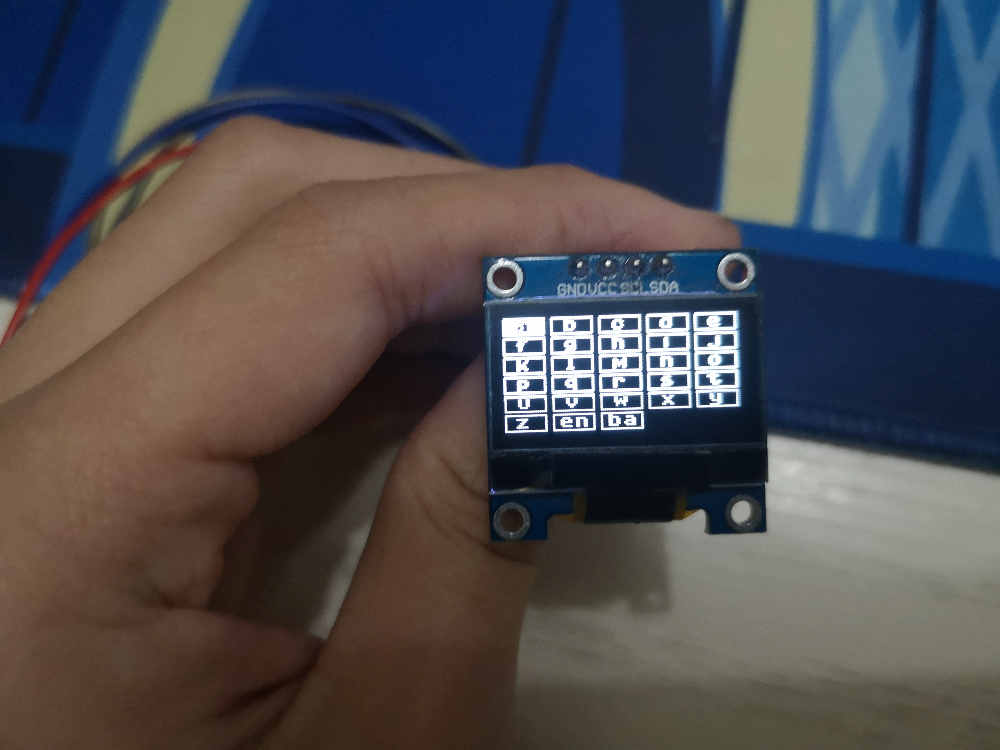
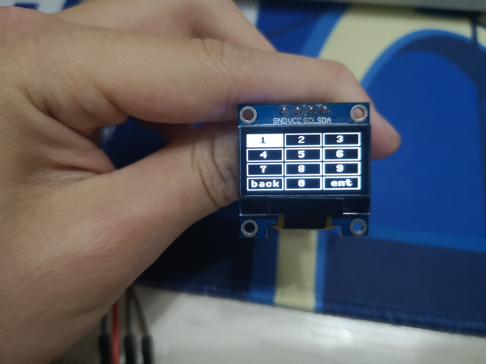
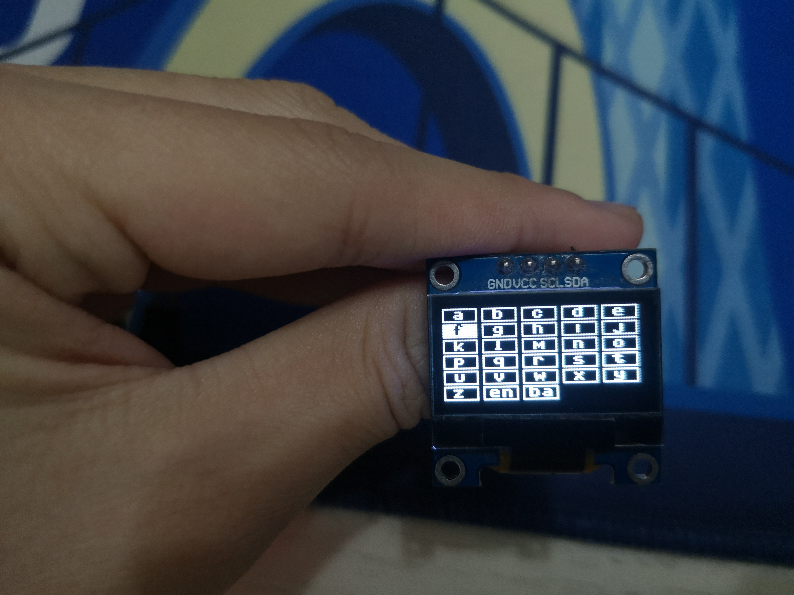
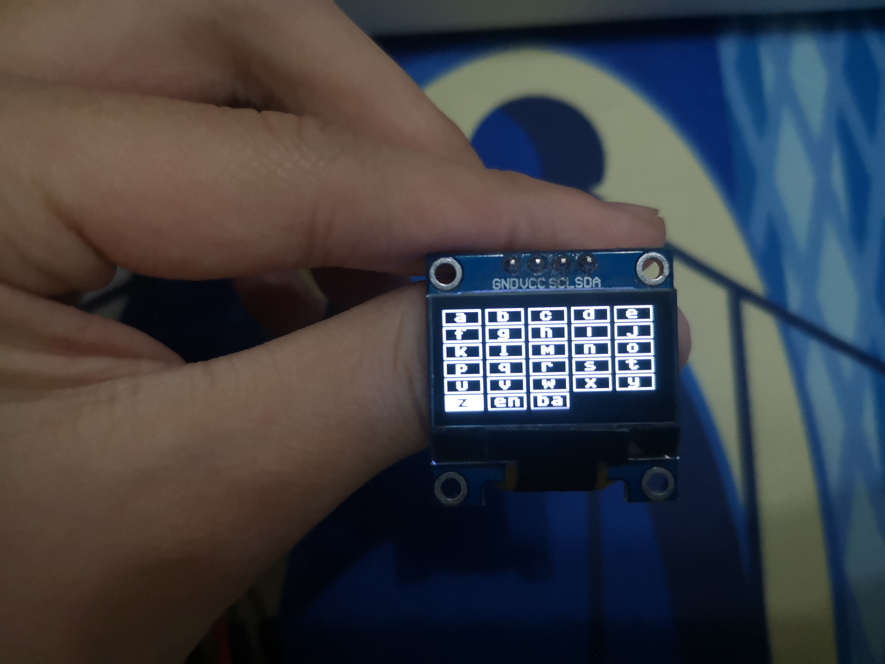
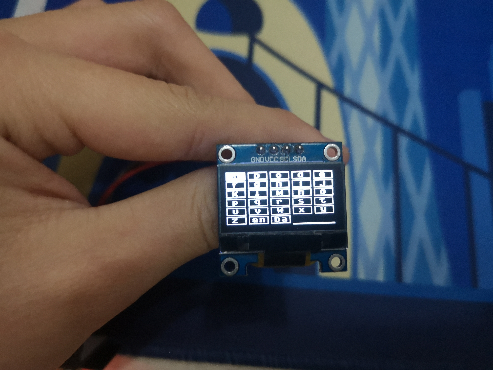
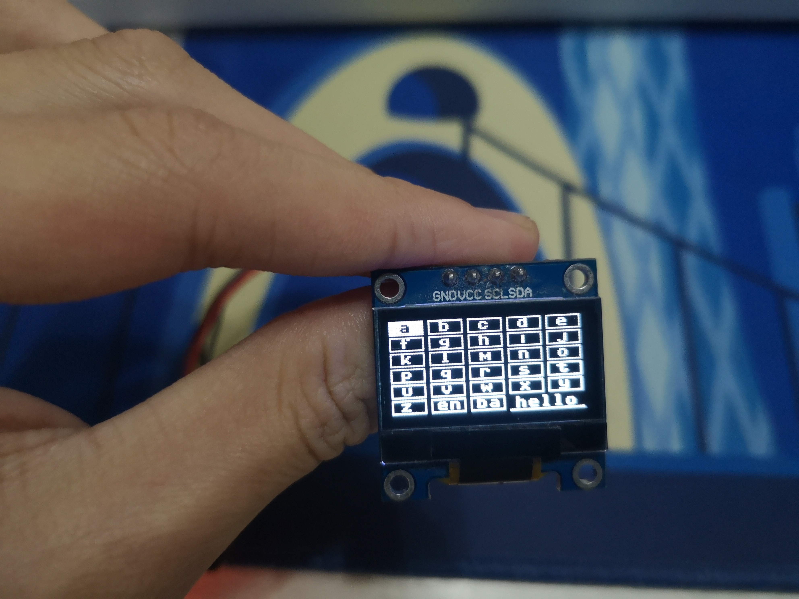
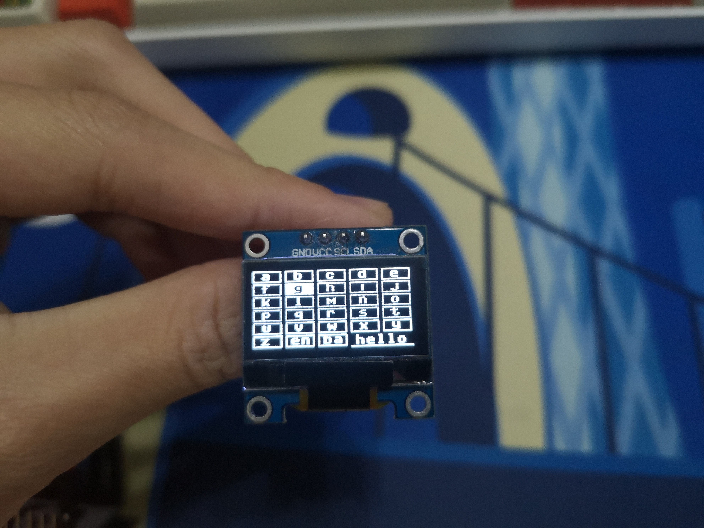

# micropython键盘输入

这是micropython的键盘输入项目，旨在用micropython语言的ssd1306显示屏上实现用上下左右确认键实现字符的输入。模块名为keyboard.py，可以上传入板子后用import keyboard来导入模块

以下用esp32-s测试

## 示例

使用前导入相关的模块：

~~~python
from machine import Pin,SoftI2C 
import ssd1306
#以上的模块用于驱动ssd1306屏幕

import keyboard #主模块
~~~

创建ssd1306屏幕对象

~~~python
i2c = SoftI2C(scl=Pin(22), sda=Pin(21), freq=100000)#创建一个I2C对象，从中指定了scl为gpio引脚22，sda为21

lcd=ssd1306.SSD1306_I2C(128,64,i2c) #创建ssd1306屏幕对象
~~~

创建keyboard对象

~~~python
k=keyboard.keyboard(lcd) #创建keyboard对象，也就是创建键盘对象，然后可以通过对这个对象的操作实现输入
k.init() #初始化键盘(在屏幕上显示26个英文字母的键盘)
~~~

随后把内容显示到屏幕上

~~~python
lcd.show() #把26个字母的键盘显示到屏幕上
~~~

最后代码加起来就是这样

~~~python
from machine import Pin,SoftI2C
import ssd1306
import keyboard
i2c = SoftI2C(scl=Pin(22), sda=Pin(21), freq=100000)
lcd=ssd1306.SSD1306_I2C(128,64,i2c)
k=keyboard.keyboard(lcd)
k.init()
lcd.show()
~~~

把代码上传至板子上，如果一切正常，显示效果是这样的

同理，你可以把代码换成

~~~python
from machine import Pin,SoftI2C
import ssd1306
import keyboard
i2c = SoftI2C(scl=Pin(22), sda=Pin(21), freq=100000)
lcd=ssd1306.SSD1306_I2C(128,64,i2c)
k=keyboard.keyboard(lcd)
k.init_num() #这里代码有所修改，方法由init改为了init_num
lcd.show()
~~~

这时显示的是数字键盘

## 具体方法

### 移动

你可以使用以下函数来移动选中的位置（以下简称指针）：

k.moveUp()使指针向上移动

k.moveDown()使指针向下移动

k.moveLeft() 使指针向左移动

k.moveRight()使指针向右移动

比方说：这是原先的位置

执行了以下代码之后

~~~python
k.moveDown() #下移
lcd.show() #刷新屏幕
~~~

很显然，指针下移到了"f"

另外三个方向的移动同理，不作解释

__模块内有做碰撞算法处理，若移动后指针会离开屏幕，则执行无效(程序不会报错，但是模块不会让指针移动)，特殊情况在下一个部分会说__

### 移动特殊情况

为了方便的切换字母输入模式和数字输入模式：

如果在字母输入模式下指针在底部，也就是"z","enter","back"这三个位置，这个时候使指针下移*k.moveDown()*，这个时候指针会进入数字输入模式，并且指针停留到"1"处，实现换页

同理，如果在数字输入模式下指针在顶部，也就是"1","2","3",这三个位置，这个时候使指针上移*k.moveUp()*，

 这个时候指针会进入字母输入模式，并且指针停留在"z"处

比如这是移动前:

执行了以下代码之后

~~~python
k.moveDown()
lcd.show()
~~~

从数字输入模式切换到字母输入模式同理，不作解释

## 标签

在一开始的示例中

~~~python
from machine import Pin,SoftI2C
import ssd1306
import keyboard
i2c = SoftI2C(scl=Pin(22), sda=Pin(21), freq=100000)
lcd=ssd1306.SSD1306_I2C(128,64,i2c)
k=keyboard.keyboard(lcd)
k.init()
lcd.show()
~~~

把代码修改，运行

~~~python
from machine import Pin,SoftI2C
import ssd1306
import keyboard
i2c = SoftI2C(scl=Pin(22), sda=Pin(21), freq=100000)
lcd=ssd1306.SSD1306_I2C(128,64,i2c)
k=keyboard.keyboard(lcd,entry=True) #创建keyboard对象是把entry设置为True,显示标签
k.init()
lcd.show()
~~~

屏幕

显然，右下角多了一条线，这就是标签

要使用标签，要在创建keyboard对象的时候设置entry为True

你可以通过以下代码来控制标签:

k.ent_append(char) 标签内追加内容，char为追加内容

k.ent_back(count) 标签退格，count为退格字符数

k.ent_clear() 清空标签，无参数，无返回

k.ent_get() 返回标签内容 无参数，返回标签内容

由于屏幕大小限制，只会显示最后5个字符

执行以下代码并运行

~~~python
from machine import Pin,SoftI2C
import ssd1306
import keyboard
i2c = SoftI2C(scl=Pin(22), sda=Pin(21), freq=100000)
lcd=ssd1306.SSD1306_I2C(128,64,i2c)
k=keyboard.keyboard(lcd,entry=True) #创建keyboard对象是把entry设置为True,显示标签
k.init()
k.ent_append('hello') #标签内追加内容 
lcd.show() #刷新屏幕
~~~

运行效果：

### 其他操作

__k.get()__

返回现在指针选中的内容，比如显示屏是上图状态，然后运行

~~~python
k.get()
~~~

之后返回'a'，说明指针选中"a"

k.goto(x,y)

把指针移动到某个位置，比如运行

~~~python
k.goto(1,1)
~~~

运行后

指针选中"g"

注意：从左上角的坐标是(0,0)

### 内部调用

k.update()

k.clear()

k.update_num()

k.clear_num()

内部调用，不要使用，否则可能有想象中不一样的结果

联系方式:

zbr20070621zbr@163.com

或者加q：2517889752

__严禁倒卖__
